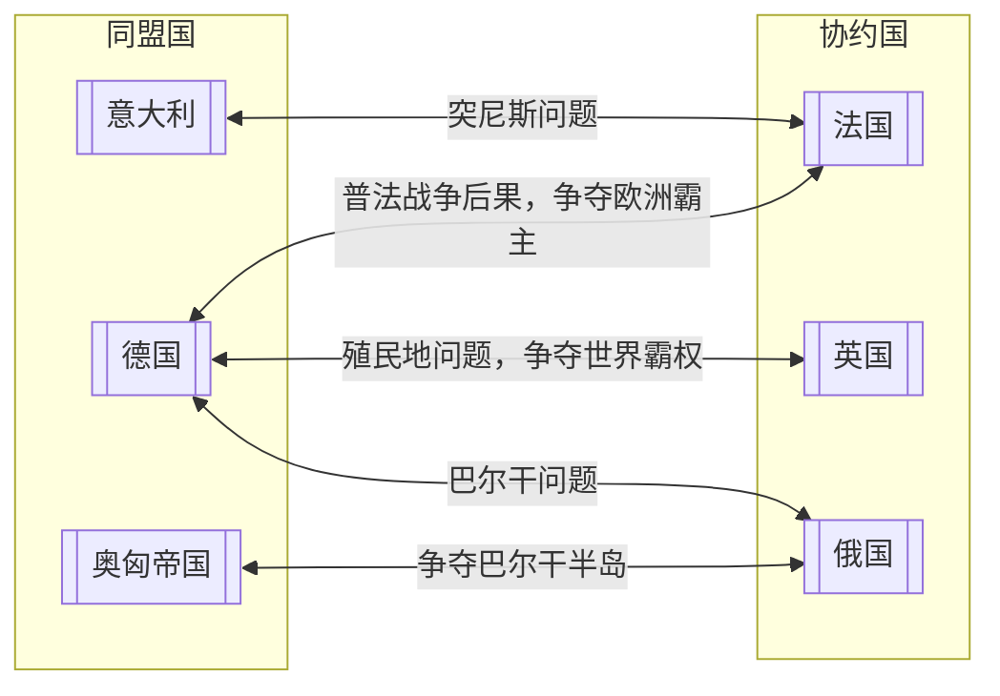

<!--stackedit_data:
eyJoaXN0b3J5IjpbLTE3NDY3MzAxODAsMTMxNTg4MjU5NiwtNz
M2OTM4ODIyLDU2OTQ3MDIzNiw0OTc4MTg4MTAsLTQwOTkwMzY1
MiwtODIxMTI3NzA4LDE5MjMyODQyNzgsLTE1OTQ5NDY1MTksLT
E4MjY1MzEwODgsOTc2OTQwNzI1LC0zMzg4NTMyMDAsMTQ1NTgz
MjI4LDQ5NzgxODgxMCw4MDg0NTc0OTcsMzQ4MDkwNzk4XX0=
-->