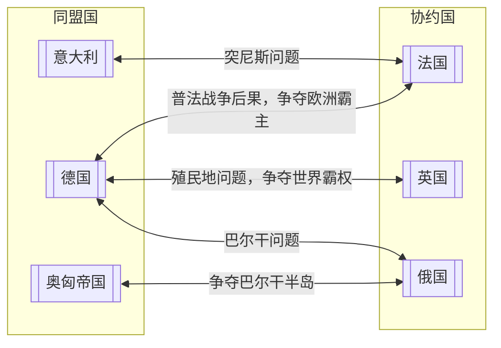

<!--stackedit_data:
eyJoaXN0b3J5IjpbLTQ1MDk0MzcxOCwxMzE1ODgyNTk2LC03Mz
Y5Mzg4MjIsNTY5NDcwMjM2LDQ5NzgxODgxMCwtNDA5OTAzNjUy
LC04MjExMjc3MDgsMTkyMzI4NDI3OCwtMTU5NDk0NjUxOSwtMT
gyNjUzMTA4OCw5NzY5NDA3MjUsLTMzODg1MzIwMCwxNDU1ODMy
MjgsNDk3ODE4ODEwLDgwODQ1NzQ5NywzNDgwOTA3OThdfQ==
-->